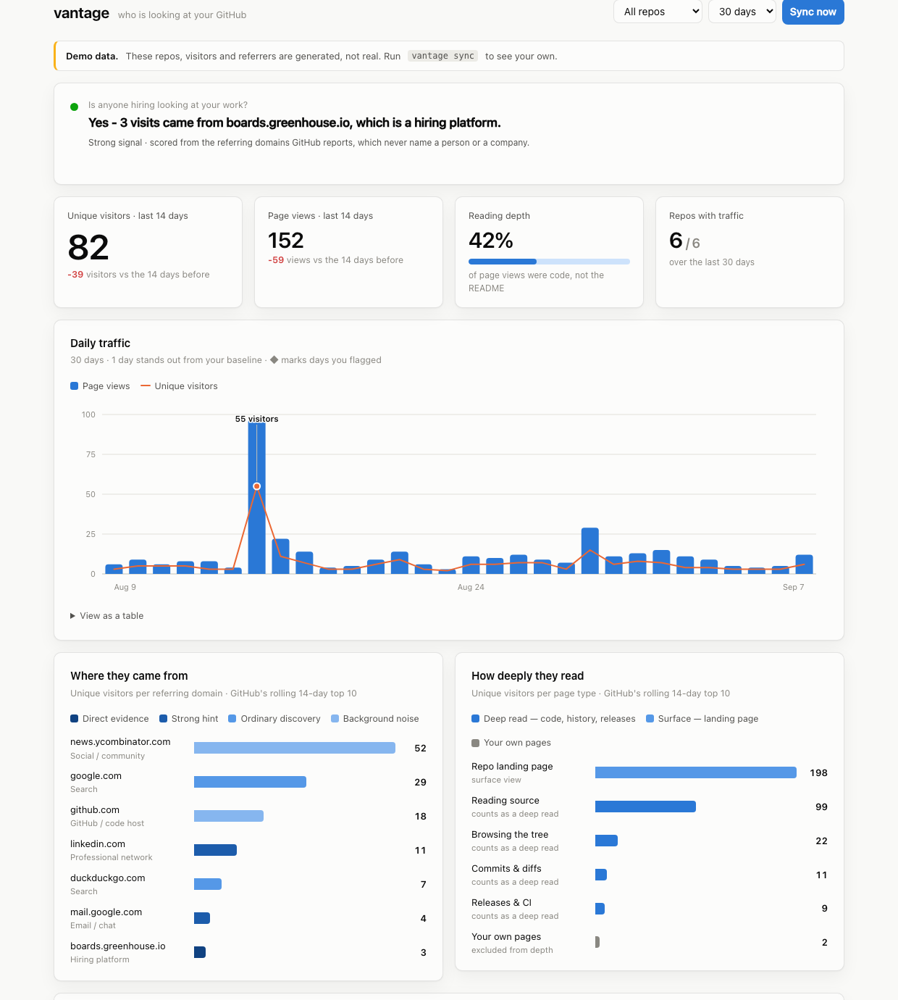

# vantage

**See who is looking at your GitHub.** A fast terminal summary and a local
dashboard, built on the `gh` CLI. No dependencies, no accounts, no data leaving
your machine.

<picture>
  <source media="(prefers-color-scheme: dark)" srcset="docs/dashboard-dark.png">
  
</picture>

<sub>Screenshot uses `vantage demo` — generated data, not real traffic.</sub>

```console
$ vantage
  ✓ tide-gauge     1/6
  ✓ otter          2/6
  …
  synced 6 repos in 3.1s

  ●  Yes - 3 visits came from boards.greenhouse.io, which is a hiring platform.

  82 visitors  -39   152 views  -59   786 clones
```

## Why

GitHub shows you repo traffic, but with two problems:

1. **It deletes it after 14 days.** There is no API to get it back. If you did
   not look, it never happened.
2. **It shows one repo at a time,** as raw counts, with no read on what they
   mean. Fifty views from Google and three from a Greenhouse job board look
   identical on that page — but only one of them means somebody is deciding
   whether to interview you.

vantage fixes both. Every sync snapshots all your repos into a local SQLite
database, so history accumulates for as long as you keep running it. Then it
grades each referring domain by how strongly it implies evaluation rather than
passing traffic, and gives you the answer as a sentence.

## Install

Needs Python 3.8+, and the [GitHub CLI](https://cli.github.com) already logged
in (`gh auth login`). vantage borrows `gh`'s token — there is nothing else to
set up.

```bash
git clone https://github.com/deknapp/vantage
cd vantage
pip install -e .          # or: pipx install .
```

Or skip installing entirely — it is stdlib-only, so it runs from the checkout:

```bash
python3 -m vantage
```

## Use

```bash
vantage                 # sync, then print the report — the one you'll type
vantage sync            # fetch only
vantage report          # print only
vantage serve           # open the dashboard at localhost:7373
vantage demo            # synthetic data, to see it all without waiting 14 days
```

Mark the days that matter, and the timeline shows whether anything followed:

```bash
vantage note "Applied to Northbridge — staff platform engineer"
vantage note "Sent GitHub link to a recruiter" --date 2026-09-02 --kind outreach
```

Other useful flags:

```bash
vantage report --days 365 --repo deknapp/taper
vantage report --json | jq .signal        # the whole payload, for scripting
vantage sync --visibility public          # skip private repos
vantage sync --owner someone-else         # needs push access to their repos
vantage export --days 365 -o traffic.csv
```

Run it on a schedule so history never has a hole in it:

```bash
# crontab -e  — every morning at 9
0 9 * * * /usr/local/bin/vantage sync --quiet
```

## How the signal is scored

GitHub reports the referring **domain**, never a person or a company. So the
question "is an employer looking?" can only ever be answered by inference. The
inference vantage makes is that some domains only exist inside a hiring
workflow:

| Bucket | Weight | Why |
|---|---|---|
| Hiring platform (Lever, Greenhouse, Ashby, Workday, iCIMS…) | 1.00 | Those pages are seen by recruiters and hiring managers, not the public. Close to direct evidence. |
| Professional network (LinkedIn) · Email & chat | 0.80 | Someone clicked through from your profile, or your link is being passed around. |
| Job board (Indeed, Glassdoor, Built In…) | 0.70 | Job-seeking context, but public. |
| Other / unrecognised | 0.40 | A company's own site or internal wiki lands here. Worth a look. |
| Search · AI assistant | 0.30 | Ordinary discovery. Tracks findability, not who. |
| Social & community | 0.20 | Public sharing. One post can dwarf everything else. |
| GitHub itself | 0.05 | Mostly your own browsing. |

Subdomains match on label boundaries, so `acme.myworkdayjobs.com` and
`boards.greenhouse.io` are both recognised, while `notlever.co` is not.

Alongside that, **reading depth** — the share of page views that land on source
files, directory trees, commits, or releases rather than the README. A visitor
who opens `queue.go` is evaluating you; one who bounces off the landing page is
not. Your own visits to `/graphs/traffic` and `/pulse` are detected and held out
of the ratio, since GitHub counts the owner like anyone else.

The dashboard encodes all of this in one channel: referrer bars use an ordinal
blue ramp where **darker means stronger evidence**, so a short dark bar
(three visits from Greenhouse) visibly outranks a long pale one (fifty from
Hacker News).

## What this cannot tell you

Stated plainly, because a tool that implies more than it knows is worse than no
tool:

- **No referrer identifies anyone.** Every reading here is an inference from a
  domain name. A Greenhouse referral is strong evidence *somebody* in a hiring
  workflow clicked; it is not proof, and it never names them.
- **History starts when you start.** Days before your first sync are gone. The
  chart fills in from here.
- **Daily unique visitors de-duplicate within a day, not across days,** so a
  30-day total counts a returning visitor more than once. Treat window totals as
  a shape, not a headcount.
- **Referrers and paths are a rolling 14-day top ten,** not a log, and not
  per-day. vantage keeps every snapshot, which is how it can tell you when a
  domain *first* appeared, but it cannot rebuild the days in between.
- **Clone counts include CI, mirrors, and bots,** so they run high and mean much
  less than views.
- **Traffic needs push access,** so this works for your own repos and ones you
  collaborate on. Nobody else's.

## Design notes

A few decisions worth the words, since this doubles as a work sample:

**Auth by borrowing, not by asking.** vantage shells out to `gh auth token`
once, then talks to the REST API over `urllib`. Running `gh api` per request
costs ~200ms of process startup each, and a sync is four endpoints per repo —
that dominates everything. One token plus a thread pool turns a 30-second sync
into a 3-second one. There is no separate login, and no token stored anywhere.

**The database is the product.** The API is a 14-day window sliding over data
GitHub throws away. Everything else follows from treating each sync as an
append to permanent local history. Re-syncing is idempotent, and a day's counts
are stored with `MAX(old, new)` so a partial response can never shrink a day
already recorded.

**Zero dependencies, deliberately.** Standard library only — `sqlite3`,
`urllib`, `http.server`, hand-written SVG. The dashboard loads no CDN and
survives being offline. It also means `git clone && python3 -m vantage` works
on a machine you have never set up.

**Local means local.** The server binds loopback, rejects any `Host` header that
is not a loopback name (blocking DNS rebinding), requires a custom header on
mutating routes (which a cross-origin page cannot set without a preflight that
never succeeds), and sends a CSP that forbids every external origin.

**The charts are built to a spec.** One shared axis, never two. Categorical hues
in a fixed order, never cycled. Palettes checked for colour-vision separation
rather than eyeballed, in both light and dark. A legend whenever there is more
than one series, direct labels used sparingly, and a table view under every
chart so nothing is gated behind colour or hover.

## Tests

```bash
python3 -m unittest discover -s tests -v
```

Covers domain classification and its boundary cases, the storage semantics that
make re-syncing safe, and the aggregation both front-ends read.

## License

MIT
